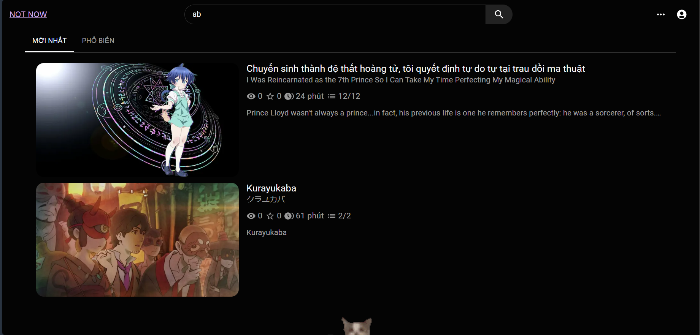
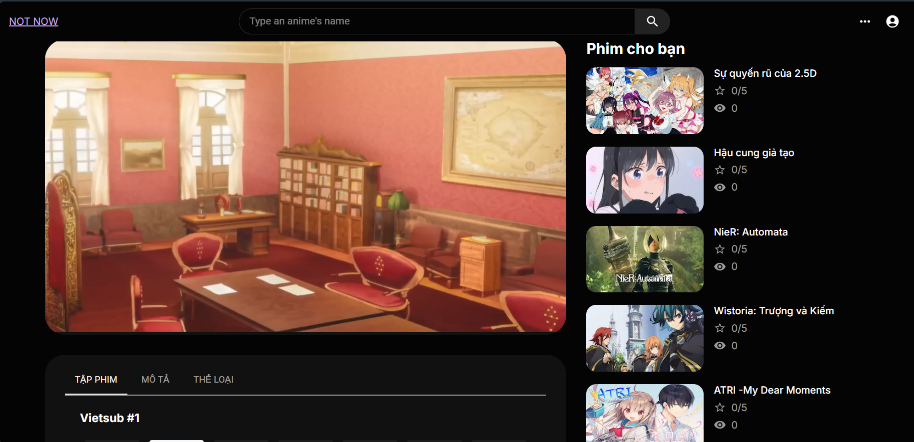

# MYANAMEL

> **NOTE:**
> This project is an educational tool for distributing anime content. By using this repository, you agree to the [legal notice](./LEGAL_NOTICE.md)

## INTRODUCTION



Anime distributor built with a Next.js frontend and Express.js + MongoDB backend. It allows users to watch anime,follow, track view counts, receive basic film recommendations. This project use crawler to an API to obtain its content. Offers personalized anime content to its users.

## GETTING STARTED
### Prerequisites
You need to have Node.js and MongoDB installed on your machine, as well as Next.js

### Installation
1. Clone the repository:
    ```bash
    git clone https://github.com/AmayaKuro/MyAnamel.git
    ```

2. Install backend dependencies:
    ```bash
    cd backend
    npm install
    ```

3. Install frontend dependencies:
    ```bash
    cd frontend
    npm install
    ```

4. Set up environment variables:
   - Create a `.env` file in the `backend` folder and configure your MongoDB connection string and JWT secret.

5. Run the application:
    - Start the backend:
        ```bash
        cd backend
        bun run dev
        ```
    - Start the frontend:
        ```bash
        cd frontend
        npm run dev
        ```

6. Access the app at `http://localhost:3000`(FE address)

> **NOTE:**
> This BE will take your local IP address at port 8000 (e.g. http://127.0.0.1:8000/), so if you want to test BE's API (using [Postman](https://www.postman.com/downloads/)), you can link your testing app to that route.

And enjoy the project :ok_hand:

## LICENSE

Distributed under the MIT License. See `LICENSE` for more information.
